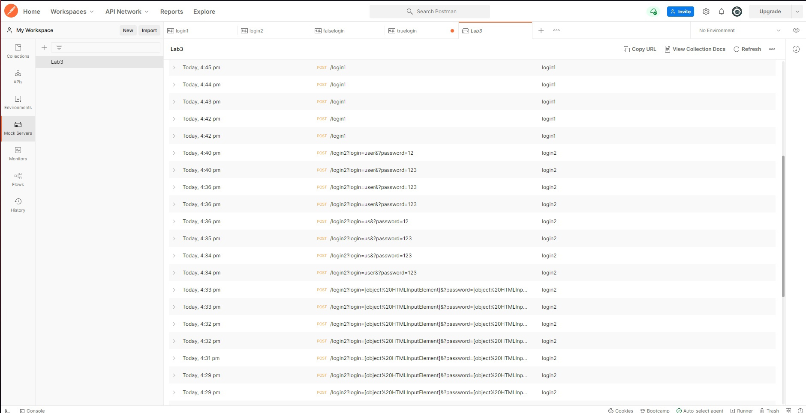
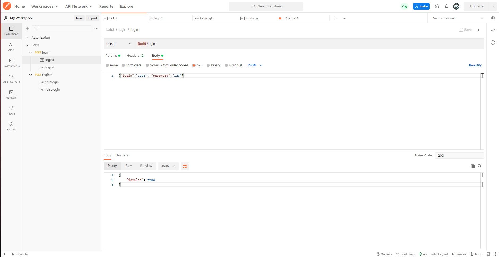
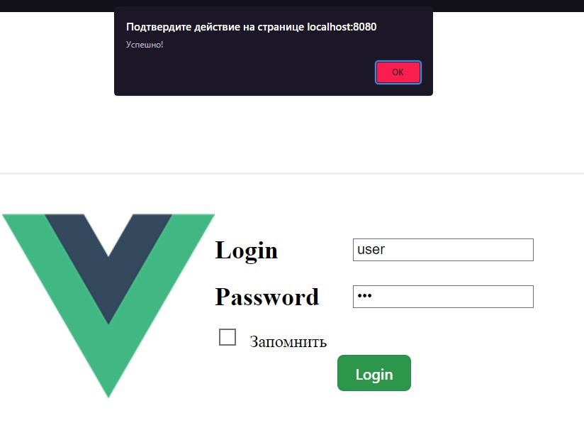
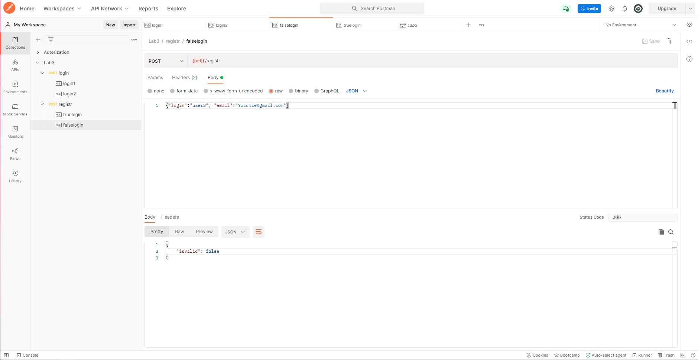
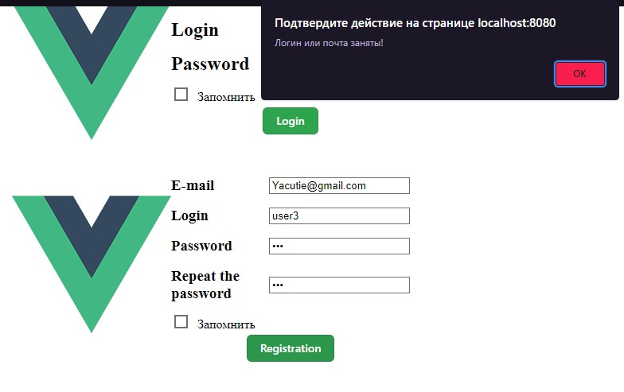

<p align = center>МИНИСТЕРСТВО НАУКИ И ВЫСШЕГО ОБРАЗОВАНИЯ

<p align = center>РОССИЙСКОЙ ФЕДЕРАЦИИ

<p align = center>ФЕДЕРАЛЬНОЕ ГОСУДАРСТВЕННОЕ БЮДЖЕТНОЕ ОБРАЗОВАТЕЛЬНОЕ УЧРЕЖДЕНИЕ ВЫСШЕГО ОБРАЗОВАНИЯ

<p align = center>«ВЯТСКИЙ ГОСУДАРСТВЕННЫЙ УНИВЕРСИТЕТ»

<p align = center>Институт математики и информационных систем

<p align = center>Факультет автоматики и вычислительной техники

<p align = center>Кафедра систем автоматизации управления
<br>
<br>
<br>
<br>

<p align = right>Дата сдачи на проверку:

<p align = right>«___» __________ 2022 г.

<p align = right>Проверено:

<p align = right>«___» __________ 2022 г.
<br>
<br>
<br>
<br>
<br>

<p align = center>Отчет по лабораторной работе № 3

<p align = center>по дисциплине

<p align = center>«Web-программирование»

<br>
<br>
<br>
<br>

<p align = center>Разработал студент гр. ИТб-2301-01-00 ________________ /Заболотский А.Н./

<p align = center>Проверил ст. преподаватель _________________ /Земцов М.А./

<p align = center>Работа защищена с оценкой «___________» «___» __________ 2022 г.

<br>
<br>
<br>
<br>

<p align = center>Киров 2022

<hr>
Цель:  провести тестирование отправки axios-запроса на mock-сервер

Задачи:

1. Организовать процесс работы над лабораторной работой
1. Сверстать блок регистрации
1. Создать mock-сервер в Postman
1. Отправить запрос на mock-сервер и получить ответ

Ход выполнения:

1. Организовать процесс работы над лабораторной работой

Для работы в репозитории _[ссылка на репозиторий](https://github.com/Konas18/WebLab/tree/Lab3)_ на сайте github.com была создана новая ветвь с названием Lab3 от ветки Lab2.

2. Сверстать блок регистрации

В компонент Registration была добавлена адаптивная верстка блока регистрации, аналогично блоку входа, соданому в ходе предыдущей лабораторной работы.

3. Создать mock-сервер в Postman

В ходе выполнения работы с помощью Postman был создан Mock Server. Созданный Mock Server представлен на рисунке 3.

<p align=center></p>

<p align = center>Рисунок 3 – Mock Server

В рамках лабораторной работы были созданы два Post запроса.
В первом случае Post запрос используется для проверки введенного логина и пароля. Реализация запроса изображена на рисунке 4. Результат его работы показан на рисунке 5.

<p align=center></p>

<p align = center>Рисунок 4 – Post запрос

<p align=center></p>

<p align = center>Рисунок 5 – Удачный вход

Во втором случае Post запрос используется для проверки уникальности логина и E-mail при регистрации. Реализация запроса изображена на рисунке 6. Результат его работы показан на рисунке 7.

<p align=center></p>

<p align = center>Рисунок 6 – Post запрос

<p align=center></p>

<p align = center>Рисунок 7 – Неудачная регистрация

В компоненте Registration предусмотрена проверка на ввод почты, пароля и совпадения введенных паролей
Листинг компонента Registration представлен в приложении А.

Вывод: в ходе лабораторной работы было проведено тестирование отправки axios-запроса на mock-сервер.

<p align = center>Приложение А

<p align = center>(обязательное)

<p align = center>Листинг компонента Regisration.vue

```html
<template>
  <section id="app" class="flex">
    <div></div>
    <div>
      <div class="imput-desk">
        <div class="flex text-imput">
          <h3 class="mr10 mt8 mb8">E-mail</h3>
          <input id="e-mail" class="input" type="text" />
        </div>
        <div class="flex text-imput">
          <h3 class="mr10 mt8 mb8">Login</h3>
          <input id="reglogin" class="input" type="text" />
        </div>
        <div class="flex text-imput">
          <h3 class="mr10 mt8 mb8">Password</h3>
          <input id="password1" class="input" type="password" />
        </div>
        <div class="flex text-imput">
          <h3 class="mr10 mt8 mb8">Repeat the password</h3>
          <input id="password2" class="input" type="password" />
        </div>
      </div>
      <div class="imput-mobil">
        <div class="flex text-imput">
          <input
            id="e-mail2"
            placeholder="E-mail"
            class="input mr10 mt8 mb8"
            type="text"
          />
        </div>
        <div class="flex text-imput">
          <input
            id="reglogin2"
            placeholder="Login"
            class="input mr10 mt8 mb8"
            type="text"
          />
        </div>
        <div class="flex text-imput">
          <input
            id="password22"
            placeholder="Password"
            class="input mr10 mt8 mb8"
            type="password"
          />
        </div>
        <div class="flex text-imput">
          <input
            id="password22"
            placeholder="Repeat the password"
            class="input mr10 mt8 mb8"
            type="password"
          />
        </div>
      </div>
      <div class="checkbox-imput">
        <input class="checkbox mr10 mt8 mb8" type="checkbox" unchecked />
        <label class="">Запомнить</label>
      </div>
      <div id="button-div">
        <button v-on:click="signOn" class="button-3" role="button">
          Registration
        </button>
      </div>
    </div>
  </section>
</template>

<script lang="ts">
  import { Component, Vue } from 'vue-property-decorator';
  import axios from 'axios';
  export default {
    methods: {
      signOn() {
        const email: HTMLInputElement = document.getElementById(
          'e-mail'
        ) as HTMLInputElement;
        const log: HTMLInputElement = document.getElementById(
          'reglogin'
        ) as HTMLInputElement;
        const pass1: HTMLInputElement = document.getElementById(
          'password1'
        ) as HTMLInputElement;
        const pass2: HTMLInputElement = document.getElementById(
          'password1'
        ) as HTMLInputElement;
        const config = {
          url: 'https://2febd279-e9d3-47fc-be42-4492df8eb673.mock.pstmn.io/registr',
        };
        const data = {
          email: email.value,
          login: log.value,
        };
        if (email.value === '') {
          alert('Введите почту!');
          return;
        }
        if (log.value === '') {
          alert('Введите логин!');
          return;
        }
        if (pass1.value === '') {
          alert('Введите пароль!');
          return;
        }
        if (pass2.value !== pass1.value) {
          alert('Пароли не совпадают!');
          return;
        }
        axios
          .post(config.url, data, {
            headers: { 'x-mock-match-request-body': true },
          })
          .then((response) => {
            console.log(response.data);
            if (response.data) {
              alert('Логин или почта заняты!');
            }
          })
          .catch((error) => {
            console.log(error);
            alert('Успешно!');
          });
      },
    },
  };
</script>

<style>
  #app {
    justify-content: center;
    align-items: center;
    display: flex;
  }
  #button-div {
    display: flex;
    justify-content: center;
  }
  .imput-mobil {
    display: none;
  }
  .input {
    max-width: 200px;
    height: 50%;
  }
  .text-imput {
    width: 300px;
    align-items: center;
    justify-content: space-between;
  }
  .mb8 {
    margin-bottom: 8px;
  }
  .checkbox-imput {
    align-items: center;
  }
  @media screen and (max-width: 1200px) {
    .checkbox-imput {
      justify-content: center;
      display: flex;
    }
    .imput-mobil {
      display: block;
    }
    .imput-desk {
      display: none;
    }
  }
  .checkbox {
    width: 17px;
    height: 17px;
  }
  .mt8 {
    margin-top: 8px;
  }
  .jbf {
    justify-content: space-between;
  }
  .flex {
    display: flex;
    flex-direction: row;
  }
  @media screen and (max-width: 1200px) {
    .flex {
      flex-direction: column;
    }
  }
  .mr10 {
    margin-right: 12px;
  }
  /* CSS */
  .button-3 {
    appearance: none;
    background-color: #2ea44f;
    border: 1px solid rgba(27, 31, 35, 0.15);
    border-radius: 6px;
    box-shadow: rgba(27, 31, 35, 0.1) 0 1px 0;
    box-sizing: border-box;
    color: #fff;
    cursor: pointer;
    display: inline-block;
    font-family: -apple-system, system-ui, 'Segoe UI', Helvetica, Arial,
      sans-serif, 'Apple Color Emoji', 'Segoe UI Emoji';
    font-size: 14px;
    font-weight: 600;
    line-height: 20px;
    padding: 6px 16px;
    position: relative;
    text-align: center;
    text-decoration: none;
    user-select: none;
    -webkit-user-select: none;
    touch-action: manipulation;
    vertical-align: middle;
    white-space: nowrap;
  }
  .button-3:focus:not(:focus-visible):not(.focus-visible) {
    box-shadow: none;
    outline: none;
  }
  .button-3:hover {
    background-color: #2c974b;
  }
  .button-3:focus {
    box-shadow: rgba(46, 164, 79, 0.4) 0 0 0 3px;
    outline: none;
  }
  .button-3:disabled {
    background-color: #94d3a2;
    border-color: rgba(27, 31, 35, 0.1);
    color: rgba(255, 255, 255, 0.8);
    cursor: default;
  }
  .button-3:active {
    background-color: #298e46;
    box-shadow: rgba(20, 70, 32, 0.2) 0 1px 0 inset;
  }
</style>
```
