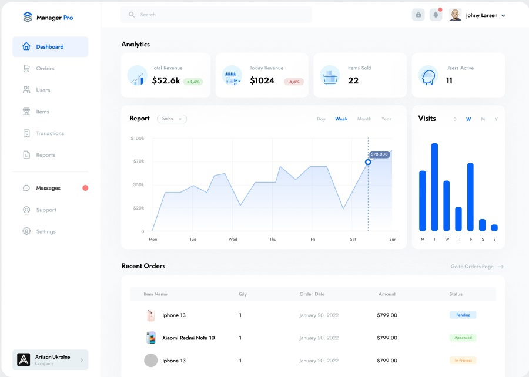
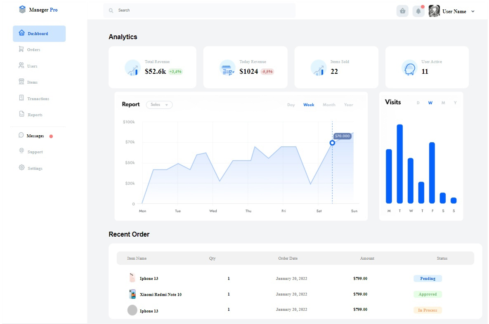
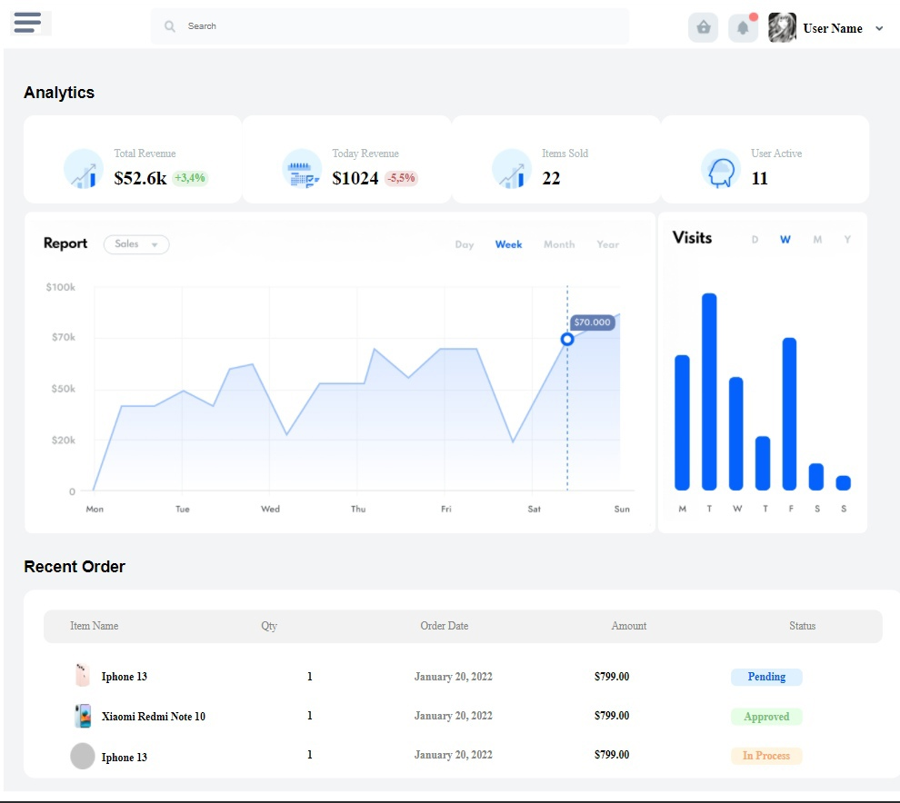

<p align = center>МИНИСТЕРСТВО НАУКИ И ВЫСШЕГО ОБРАЗОВАНИЯ

<p align = center>РОССИЙСКОЙ ФЕДЕРАЦИИ

<p align = center>ФЕДЕРАЛЬНОЕ ГОСУДАРСТВЕННОЕ БЮДЖЕТНОЕ ОБРАЗОВАТЕЛЬНОЕ УЧРЕЖДЕНИЕ ВЫСШЕГО ОБРАЗОВАНИЯ

<p align = center>«ВЯТСКИЙ ГОСУДАРСТВЕННЫЙ УНИВЕРСИТЕТ»

<p align = center>Институт математики и информационных систем

<p align = center>Факультет автоматики и вычислительной техники

<p align = center>Кафедра систем автоматизации управления
<br>
<br>
<br>
<br>

<p align = right>Дата сдачи на проверку:

<p align = right>«___» __________ 2022 г.

<p align = right>Проверено:

<p align = right>«___» __________ 2022 г.
<br>
<br>
<br>
<br>
<br>

<p align = center>Отчет по лабораторной работе № 4

<p align = center>по дисциплине

<p align = center>«Web-программирование»

<br>
<br>
<br>
<br>

<p align = center>Разработал студент гр. ИТб-2301-01-00 ________________ /Заболотский А.Н./

<p align = center>Проверил ст. преподаватель _________________ /Земцов М.А./

<p align = center>Работа защищена с оценкой «___________» «___» __________ 2022 г.

<br>
<br>
<br>
<br>

<p align = center>Киров 2022

<hr>
Цель:  сверстать макета с помощью фреймворка Vue

Задачи:

1. Организовать процесс работы над лабораторной работой
1. Выбрать dashboard-макет в Figma Community
1. Сверстать dashboard-страницу, разбив её на компоненты Vue
1. Реализовать адаптивную верстку под мобильное устройство

Ход выполнения:

1. Организовать процесс работы над лабораторной работой

Для работы в репозитории _[ссылка на репозиторий](https://github.com/Konas18/WebLab/tree/Lab4)_ на сайте github.com была создана новая ветвь с названием lab4. В проект были добавлены компоненты App.vue, TopBar.vue, SideBar.Vue, Charts.vue, RecentOrders.vue, Analytics.vue. Листинг компоненита App.vue представлен в приложении А.

2. Выбрать dashboard-макет в Figma Community

На электронном ресурсе с готовыми макетами Figma Community был выбран макет, представленный на рисунке 1.

<p align=center></p>

<p align = center>Рисунок 1 – Dashboard-макет

3. Сверстать dashboard-страницу, разбив её на компоненты Vue

В ходе выполнения работы были выделены логические компоненты макета, а именно: TopBar, SideBar, Charts, RecentOrders, Analytics. Листинги компонентов представлены в приложении Б, приложении В,приложении Г,приложении Д и приложении Ж соответственно.

Реализованный макет представлен на рисунке 2.

<p align=center></p>

<p align = center>Рисунок 2 – Dashboard-макет для Desctop

<p align = center>2
<hr>

4. Реализовать адаптивную верстку под мобильное устройство

С помощью медиа запросов была реализована способность страницы адаптироваться под мобильные устройства. Результат продемонстрирован на рисунке 3.

<p align=center></p>

<p align = center>Рисунок 3 – Dashboard-макет для мобильных устройств

<p align = center>3
<hr>

Вывод: в ходе лабораторной работы были закреплены навыки работы с фреймворком Vue. Реализован Dashboard-макет для компьютеров и мобильных устройств.

<p align = center>4
<hr>

<p align = center>Приложение А

<p align = center>(обязательное)

<p align = center>Листинг компонента App.vue

```html
// макет
https://www.figma.com/file/ljYL6wW2M69AKT4avaH1IK/Sales-Management-Dashboard-(Community)?node-id=8%3A485
<template>
  <div id="app" class="flex fullbackground">
    <div>
      <Sidebar></Sidebar>
    </div>
    <div class="full">
      <TopBar></TopBar>
      <div class="mainContent-div">
        <Analytics></Analytics>
        <Charts></Charts>
        <RecentOrder></RecentOrder>
      </div>
    </div>
  </div>
</template>

<script lang="ts">
  /*eslint-disable*/
  import { Component, Vue } from 'vue-property-decorator';
  import Sidebar from './components/Sidebar.vue';
  import TopBar from './components/TopBar.vue';
  import Analytics from './components/Analytics.vue';
  import Charts from './components/Charts.vue';
  import RecentOrder from './components/RecentOrders.vue';
  @Component({
    components: {
      Sidebar,
      TopBar,
      Analytics,
      Charts,
      RecentOrder,
    },
  })
  export default class App extends Vue {}
</script>
<style></style>
```

<p align = center>3
<hr>

<p align = center>Приложение Б

<p align = center>(обязательное)

<p align = center>Листинг компонента TopBar.vue

```html
<template>
  <section class="Topbar white-section">
    <div>
      <button class="NavigationBtn" v-on:click="openNavbarPanel">
        <svg
          width="50"
          height="32"
          viewBox="0 0 50 32"
          fill="none"
          xmlns="http://www.w3.org/2000/svg"
        >
          <g clip-path="url(#clip0_101_2)">
            <rect width="40" height="32" fill="#FFFFFF" />
            <rect y="1" width="40" height="6" rx="3" fill="#67748E" />
            <rect y="13" width="40" height="6" rx="3" fill="#67748E" />
            <rect y="25" width="30" height="6" rx="3" fill="#67748E" />
          </g>
          <defs>
            <clipPath id="clip0_101_2">
              <rect width="50" height="32" fill="white" />
            </clipPath>
          </defs>
        </svg>
      </button>
    </div>
    <div class="SearchDiv flex mt5">
      <div class="flex ml20 mt13 mb13">
        
      </div>
      <div class="flex mt13 mb13 mr200">
        <input class="Search" placeholder="Search" />
      </div>
    </div>
    <div class="flex">
      <div class="BasketDiv">
        
      </div>
      <div class="NotificationDiv">
        
      </div>
      <div class="User">
        <div>
          
        </div>
        <div>
          <h3 class="ml10 mt25">User Name</h3>
        </div>
        <div>
          
        </div>
      </div>
    </div>
  </section>
</template>
```

<p align = center>5
<hr>

<p align = center>Приложение В

<p align = center>(обязательное)

<p align = center>Листинг компонента SideBar.vue

```html
<template>
  <section class="white-section">
    <div class="Sidbar">
      <nav class="Logo">
        <div class="mt13"></div>
        <div class="flex">
          <h3 class="ml10">Maneger</h3>
          <h3 class="blue ml5">Pro</h3>
        </div>
      </nav>
      <nav class="MainNav">
        <div class="flex FocusMenuItem">
          
          <h4 class="ml10">Dashboard</h4>
        </div>
        <div class="flex MenuItem">
          
          <h4 class="ml10">Orders</h4>
        </div>
        <div class="flex MenuItem">
          
          <h4 class="ml10">Users</h4>
        </div>
        <div class="flex MenuItem">
          
          <h4 class="ml10">Items</h4>
        </div>
        <div class="flex MenuItem">
          
          <h4 class="ml10">Tranactions</h4>
        </div>
        <div class="flex MenuItem">
          
          <h4 class="ml10">Reports</h4>
        </div>
      </nav>
      <nav class="ServiceNav">
        
        <div class="flex MenuItem">
          
          <h4 class="ml10 black">Messages</h4>
          
        </div>
        <div class="flex MenuItem">
          
          <h4 class="ml10">Support</h4>
        </div>
        <div class="flex MenuItem">
          
          <h4 class="ml10">Settings</h4>
        </div>
      </nav>
    </div>
  </section>
</template>
```

<p align = center>6
<hr>

<p align = center>Приложение Г

<p align = center>(обязательное)

<p align = center>Листинг компонента Chart.vue

```html
<template>
  <section>
    <div class="flex jef mt13 analytics-section">
      <div class="ChartDiv">
        
      </div>
      <div class="ChartDiv mr50">
        
      </div>
    </div>
  </section>
</template>
```

<p align = center>7
<hr>

<p align = center>6
<hr>
<p align = center>Приложение D

<p align = center>(обязательное)

<p align = center>Листинг компонента RecentOrders.vue

```html
<template>
  <section class="orders-section">
    <div class="mt13 font-family-h2"><h2>Recent Order</h2></div>
    <div class="orders-div">
      <div class="table-titles">
        <p class="ml40">Item Name</p>
        <p>Qty</p>
        <p>Order Date</p>
        <p>Amount</p>
        <p class="mr100">Status</p>
      </div>
      <div class="table-items">
        <div>
          <div class="flex">
            
            <h4>Iphone 13</h4>
          </div>
          <div class="flex">
            
            <h4>Xiaomi Redmi Note 10</h4>
          </div>
          <div class="flex">
            
            <h4>Iphone 13</h4>
          </div>
        </div>
        <div>
          <div class="mt18"><h4>1</h4></div>
          <div class="mt40"><h4>1</h4></div>
          <div class="mt40"><h4>1</h4></div>
        </div>
        <div class="Order-date-div">
          <div class="mt18"><h4>January 20, 2022</h4></div>
          <div class="mt40"><h4>January 20, 2022</h4></div>
          <div class="mt40"><h4>January 20, 2022</h4></div>
        </div>
        <div>
          <div class="mt18"><h4>$799.00</h4></div>
          <div class="mt40"><h4>$799.00</h4></div>
          <div class="mt40"><h4>$799.00</h4></div>
        </div>
        <div>
          <div class="mt18 status-pending">Pending</div>
          <div class="mt33 status-approved">Approved</div>
          <div class="mt33 status-in-process">In Process</div>
        </div>
      </div>
    </div>
  </section>
</template>
<style>
  .displayNone {
    display: none;
  }
  .font-family-h2 {
    font-family: sans-serif;
  }
  .flex {
    display: flex;
  }
  .jbf {
    justify-content: space-between;
  }
  .jef {
    justify-content: space-around;
  }
  .Logo {
    margin-left: 50px;
    display: flex;
  }
  .icon {
    max-width: 26px;
    max-height: 26px;
  }
  .phone {
    max-width: 40px;
    max-height: 40px;
  }
  .status-pending {
    font-family: 'Renner*';
    font-style: normal;
    font-weight: 700;
    font-size: 16px;
    line-height: 14px;
    text-align: center;
    color: #0561fc;
    background-color: #dff0ff;
    padding-left: 18px;
    padding-right: 18px;
    padding-top: 6px;
    padding-bottom: 6px;
    border-radius: 8px;
  }
  .status-approved {
    font-family: 'Renner*';
    font-style: normal;
    font-weight: 700;
    font-size: 16px;
    line-height: 14px;
    text-align: center;
    color: #78c278;
    background-color: #e6fde6;
    padding-left: 18px;
    padding-right: 18px;
    padding-top: 6px;
    padding-bottom: 6px;
    border-radius: 8px;
  }
  .status-in-process {
    font-family: 'Renner*';
    font-style: normal;
    font-weight: 700;
    font-size: 16px;
    line-height: 14px;
    text-align: center;
    color: #faa86d;
    background-color: #fff4df;
    padding-left: 18px;
    padding-right: 18px;
    padding-top: 6px;
    padding-bottom: 6px;
    border-radius: 8px;
  }
  .Order-date-div {
    color: #878787;
    font-weight: bold;
  }
  .table-items {
    margin-top: 20px;
    margin-left: 70px;
    margin-right: 120px;
    display: flex;
    justify-content: space-between;
  }
  .table-titles {
    background-color: #a6a9aa26;
    border-radius: 13px;
    margin-top: 20px;
    margin-left: 30px;
    display: flex;
    justify-content: space-between;
    color: #878787;
  }
  .orders-div {
    padding-top: 10px;
    padding-right: 30px;
    background-color: white;
    border-radius: 17px;
  }
  .orders-section {
    margin-left: 60px;
  }
  .ChartDiv {
    padding: 7px;
    border-radius: 10px;
    background-color: white;
    margin-bottom: 18px;
  }
  .AnalyticText {
    font-size: 28px;
    line-height: 22px;
    font-weight: 700;
  }
  .AnalyticPersentGreen {
    font-family: 'Renner*';
    font-style: normal;
    font-weight: 700;
    font-size: 16px;
    line-height: 14px;
    text-align: center;
    color: #65c565;
  }
  .AnalyticPersentRed {
    font-family: 'Renner*';
    font-style: normal;
    font-weight: 700;
    font-size: 16px;
    line-height: 14px;
    text-align: center;
    color: #c56565;
  }
  .AnalyticPersentGreen-div {
    background-color: #65c5652a;
    margin-left: 8px;
    box-sizing: border-box;
    padding: 5px;
    border-radius: 11px;
  }
  .AnalyticPersentRed-div {
    background-color: #f4e3e3;
    margin-left: 8px;
    box-sizing: border-box;
    padding: 5px;
    border-radius: 11px;
  }
  .AnalyticIcon {
    width: 60px;
    height: 60px;
    margin-bottom: 30px;
  }
  .AnalyticItem {
    color: #aeb9be;
  }
  .analytics-div {
    background-color: white;
    border-radius: 17px;
    max-height: 270;
    max-width: 400;
  }
  .analytics-section {
    margin-left: 60px;
  }
  .UserImg {
    margin-top: 12px;
    margin-left: 15px;
    max-width: 45px;
    max-height: 45px;
    border-radius: 8px;
  }
  .User {
    display: flex;
    margin-right: 50px;
  }
  .elips {
    max-width: 13px;
    max-height: 13px;
  }
  .Topbar {
    margin-bottom: 12px;
    display: flex;
    justify-content: space-between;
  }
  .Sidbar {
    margin-left: 10px;
    margin-right: 80px;
    max-height: 100%;
    max-width: 100%;
    height: 1200px;
  }
  .all-analytics {
    display: flex;
    justify-content: space-between;
  }
  .NavigationBtn {
    display: none;
    margin-top: 10px;
    margin-left: 10px;
    cursor: pointer;
    background-color: #f5f5f5;
    border: none;
  }
  @media screen and (max-width: 1000px) {
    .Sidbar {
      display: none;
    }
    .mainContent-div {
      box-sizing: border-box;
      padding: 0px;
      height: 100%;
      width: 100%;
    }
    .analytics-section {
      margin-left: 10px;
    }
    .orders-section {
      margin-left: 10px;
    }
    .AnalyticIcon {
      width: 60px;
      height: 60px;
      margin-bottom: 5px;
    }
    .NavigationBtn {
      display: block;
    }
  }
  .BasketDiv {
    margin-top: 12px;
  }
  .Basket {
    width: 45px;
    height: 45px;
  }
  .NotificationDiv {
    margin-top: 12px;
    margin-left: 15px;
  }
  .Notification {
    width: 45px;
    height: 45px;
  }
  .SearchDiv {
    background-color: #f8fafb;
    max-width: 850px;
    max-height: 55px;
    border-radius: 8px;
    margin-left: 60px;
  }
  .Search {
    margin-left: 15px;
    margin-right: 290px;
    background-color: #f8fafb;
    border: none;
  }
  .SearchImg {
    max-width: 20px;
    max-height: 20px;
    margin-top: 5px;
  }
  .FocusMenuItem {
    margin-left: 10px;
    color: rgb(0, 81, 255);
    background: rgba(111, 178, 255, 0.336);
    border-radius: 8px;
  }
  .MenuItem {
    margin-left: 10px;
    color: #aeb9be;
    border-radius: 8px;
  }
  .MainNav {
    margin-top: 30px;
    margin-left: 20px;
    max-width: 270px;
    max-height: 550px;
  }
  .ServiceNav {
    margin-left: 20px;
    max-width: 270px;
    max-height: 350px;
  }
  .mainContent-div {
    box-sizing: border-box;
    padding: 20px;
    height: 100%;
    width: 100%;
  }
  .white-section {
    background-color: white;
  }
  .fullbackground {
    background-color: #aeb9be27;
    width: max-content;
  }
  .full {
    width: 100%;
  }
  .ml60 {
    margin-left: 60px;
  }
  .ml40 {
    margin-left: 40px;
  }
  .ml20 {
    margin-left: 20px;
  }
  .ml15 {
    margin-left: 15px;
  }
  .ml10 {
    margin-left: 10px;
  }
  .ml5 {
    margin-left: 5px;
  }
  .mt50 {
    margin-top: 50px;
  }
  .mt40 {
    margin-top: 40px;
  }
  .mt33 {
    margin-top: 33px;
  }
  .mt25 {
    margin-top: 25px;
  }
  .mt20 {
    margin-top: 20px;
  }
  .mt18 {
    margin-top: 18px;
  }
  .mt13 {
    margin-top: 13px;
  }
  .mt8 {
    margin-top: 8px;
  }
  .mt5 {
    margin-top: 5px;
  }
  .mb40 {
    margin-bottom: 40px;
  }
  .mb13 {
    margin-bottom: 13px;
  }
  .mr200 {
    margin-right: 200px;
  }
  .mr150 {
    margin-right: 150px;
  }
  .mr100 {
    margin-right: 100px;
  }
  .mr50 {
    margin-right: 50px;
  }
  .mr20 {
    margin-right: 20px;
  }
  .mr10 {
    margin-right: 10px;
  }
  .blue {
    color: rgb(0, 81, 255);
  }
  .black {
    color: black;
  }
</style>
```

<p align = center>8
<hr>

<p align = center>Приложение Ж

<p align = center>(обязательное)

<p align = center>Листинг компонента Analytics.vue

```html
<template>
  <section class="analytics-section">
    <div>
      <h2 class="font-family-h2">Analytics</h2>
    </div>
    <div class="all-analytics">
      <div class="all-analytics">
        <div class="analytics-div flex">
          <div class="ml60 mt50 mb13">
            
          </div>
          <div class="ml15 mt33">
            <div>
              <p class="AnalyticItem">Total Revenue</p>
            </div>
            <div class="flex mr50">
              <div class="AnalyticText">$52.6k</div>
              <div class="AnalyticPersentGreen-div">
                <div class="AnalyticPersentGreen">+3,4%</div>
              </div>
            </div>
          </div>
        </div>
        <div class="analytics-div flex">
          <div class="ml60 mt50 mb13">
            
          </div>
          <div class="ml15 mt33">
            <div>
              <p class="AnalyticItem">Today Revenue</p>
            </div>
            <div class="flex mr50">
              <div class="AnalyticText">$1024</div>
              <div class="AnalyticPersentRed-div">
                <div class="AnalyticPersentRed">-5,5%</div>
              </div>
            </div>
          </div>
        </div>
      </div>
      <div class="all-analytics">
        <div class="analytics-div flex">
          <div class="ml60 mt50 mb13">
            
          </div>
          <div class="ml15 mt33">
            <div>
              <p class="AnalyticItem">Items Sold</p>
            </div>
            <div class="flex mr50">
              <div class="AnalyticText mr100">22</div>
            </div>
          </div>
        </div>
        <div class="analytics-div flex mr50">
          <div class="ml60 mt50 mb13">
            
          </div>
          <div class="ml15 mt33">
            <div>
              <p class="AnalyticItem">User Active</p>
            </div>
            <div class="flex mr50">
              <div class="AnalyticText mr100">11</div>
            </div>
          </div>
        </div>
      </div>
    </div>
  </section>
</template>
```

<p align = center>9
<hr>
