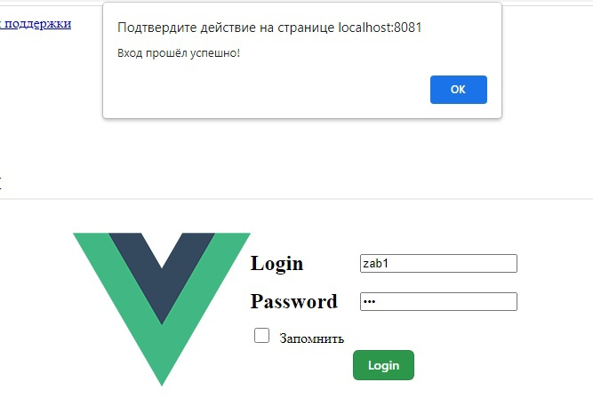
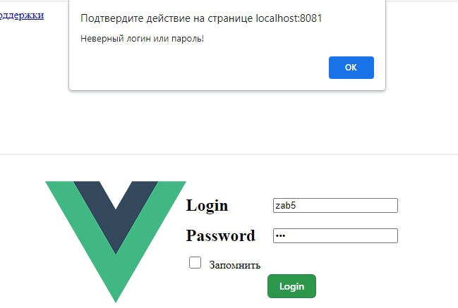
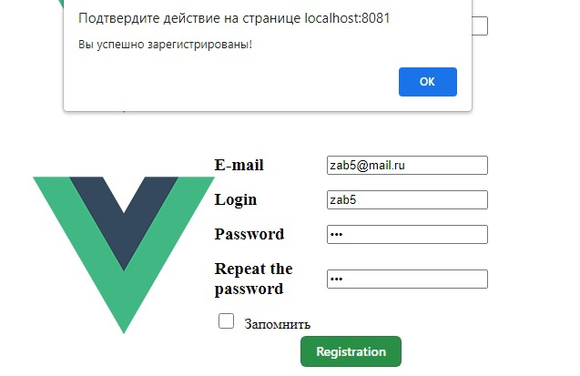
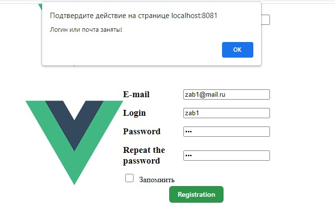
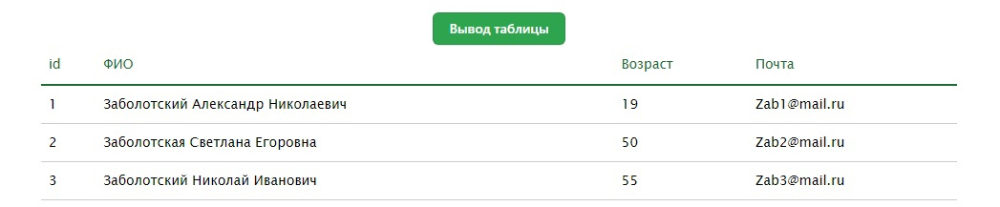
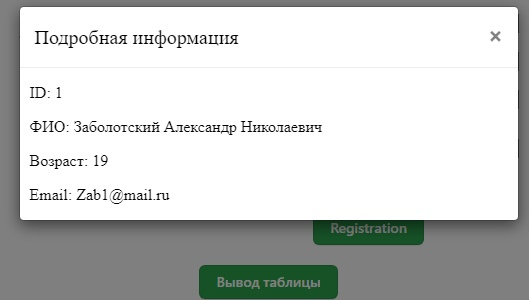

<p align = center>МИНИСТЕРСТВО НАУКИ И ВЫСШЕГО ОБРАЗОВАНИЯ

<p align = center>РОССИЙСКОЙ ФЕДЕРАЦИИ

<p align = center>ФЕДЕРАЛЬНОЕ ГОСУДАРСТВЕННОЕ БЮДЖЕТНОЕ ОБРАЗОВАТЕЛЬНОЕ УЧРЕЖДЕНИЕ ВЫСШЕГО ОБРАЗОВАНИЯ

<p align = center>«ВЯТСКИЙ ГОСУДАРСТВЕННЫЙ УНИВЕРСИТЕТ»

<p align = center>Институт математики и информационных систем

<p align = center>Факультет автоматики и вычислительной техники

<p align = center>Кафедра систем автоматизации управления
<br>
<br>
<br>
<br>

<p align = right>Дата сдачи на проверку:

<p align = right>«___» __________ 2022 г.

<p align = right>Проверено:

<p align = right>«___» __________ 2022 г.
<br>
<br>
<br>
<br>
<br>

<p align = center>Отчет по лабораторной работе № 7

<p align = center>по дисциплине

<p align = center>«Web-программирование»

<br>
<br>
<br>
<br>

<p align = center>Разработал студент гр. ИТб-2301-01-00 ________________ /Заболотский А.Н./

<p align = center>Проверил ст. преподаватель _________________ /Земцов М.А./

<p align = center>Работа защищена с оценкой «___________» «___» __________ 2022 г.

<br>
<br>
<br>
<br>

<p align = center>Киров 2022

<hr>

<p align = justify style="text-indent: 25px;">Цель: создать сервер на Java, реализовать работы 3 и 5 с использованием сервера.
<br/><br/>

<p align = justify style="text-indent: 25px;">
Задачи:

1. Организовать процесс работы над лабораторной работой.
1. Создать сервер.
1. Повторить работу лабораторных работ 3 и 5 через сервер.
   <br/><br/>

Ход выполнения:

1. Организовать процесс работы над лабораторной работой.

Для работы в репозитории _[ссылка на репозиторий](https://github.com/Konas18/WebLab/tree/Lab7)_ на сайте github.com была создана новая ветвь Lab7, а так же репозитории _[ссылка на репозиторий](https://github.com/Konas18/WebLab/tree/master)_ на сайте github.com, для сервера была создана новая ветвь master.

2. Создать сервер

В ходе выполнения лабораторной работы было создано приложение, запускающее сервер, реализованная через библиотеку Spring листинг программного кода основных классов привдене в приложении А, Б, В.

3. Повторить работу лабораторных работ 3 и 5 через сервер.

Необходимо реализовать авторизацию, регистрацию, вывод таблицы пользователей и вывод окна детализации пользователя. Демонстрация работы представлена на рисунках 1,2,3,4,5 и 6.

<p align=center> </p>
<p align = center>Рисунок 1 - Демонстрация успешной авторизации
<br><br>
<p align=center></p>
<p align = center>Рисунок 2 - Демонстрация не успешной авторизации
<br><br>
<p align=center></p>
<p align = center>Рисунок 3 - Демонстрация успешной регистрации
<br><br>
<p align=center></p>
<p align = center>Рисунок 4 - Демонстрация не успешной регистрации
<br><br>
<p align=center></p>
<p align = center>Рисунок 5 - Демонстрация вывода таблицы
<br><br>
<p align=center></p>
<p align = center>Рисунок 6 - Демонстрация детализации пользователя
<br><br>

<p align = justify style="text-indent: 25px;">Вывод: в ходе выполнения работы создан сервер на языке Java с использованием библиотеки Spring.

<br><br>

<p align = center>Приложение А

<p align = center>Листинг класса MyController

```Java
package com.controller;

import com.dto.*;
import com.service.UserService;
import org.springframework.beans.factory.annotation.Autowired;
import org.springframework.web.bind.annotation.*;

import java.util.List;

@RestController
@RequestMapping(value = "/v1")
public class MyController {

    @Autowired
    UserService userService;

    @RequestMapping(value="/user/list", method = RequestMethod.GET)
    public List<User> getUserList(){
        return userService.getList();
    }

    @RequestMapping(value = "/user/find", method = RequestMethod.POST)
    public GetUserByIdRsDto getById(@RequestBody GetUserByIdRqDto getUserByIdRqDto){
        return userService.getById(getUserByIdRqDto.getId());
    }

    @RequestMapping(value = "/user/login", method = RequestMethod.POST)
    public LoginRsDto Verification(@RequestBody LoginRqDto loginRqDto){
        return userService.Verification(loginRqDto);
    }

    @RequestMapping(value = "/user/registration", method = RequestMethod.POST)
    public RegistrationRsDto Verification(@RequestBody RegistrationRqDto registrationRqDto){
        return userService.Registration(registrationRqDto);
    }
}
```

<br><br>

<p align = center>Приложение Б

<p align = center>Листинг Классa UserServiceImpl

```Java
package com.service;

import com.dto.*;
import com.repository.UserRepository;
import org.springframework.beans.factory.annotation.Autowired;
import org.springframework.stereotype.Service;


import java.util.List;
import java.util.Locale;

@Service
public class UserServiceImpl implements UserService {

    @Autowired
    UserRepository userRepository;

    @Autowired
    public void main() {
        userRepository.getUserList()
                .add(User.builder()
                        .id(1)
                        .name("Заболотский Александр Николаевич")
                        .age(19)
                        .email("Zab1@mail.ru")
                        .login("zab1")
                        .password("123")
                    .build());
        userRepository.getUserList()
                .add(User.builder()
                        .id(2)
                        .name("Заболотская Светлана Егоровна")
                        .age(50)
                        .email("Zab2@mail.ru")
                        .login("zab2")
                        .password("123")
                        .build());userRepository.getUserList()
                .add(User.builder()
                        .id(3)
                        .name("Заболотский Николай Иванович")
                        .age(55)
                        .email("Zab3@mail.ru")
                        .login("zab3")
                        .password("123")
                        .build());
    }

    @Override
    public GetUserByIdRsDto getById(int id) {
        for (Integer ur=0; ur<userRepository.getUserList().size(); ur++){
            if (id == ur+1){
                return GetUserByIdRsDto.builder().user(userRepository.getUserList().get(ur)).build();
                //break;
            }
        }
        return null;
    }

    @Override
    public List<User> getList() {
        return userRepository.getUserList();
    }

    @Override
    public LoginRsDto Verification(LoginRqDto loginRqDto) {
        boolean ver = false;
        String rqLogin = loginRqDto.getLogin();
        String rqPassword = loginRqDto.getPassword();

        for (User ur : userRepository.getUserList())
        {
            String userLogin =  ur.getLogin();
            String userPassword =  ur.getPassword();

            if (rqLogin.equals(userLogin)){
                if (rqPassword.equals(userPassword) ){
                    ver = true;
                }
            }
        }
        return LoginRsDto.builder().verification(ver).build();
    }

    @Override
    public RegistrationRsDto Registration(RegistrationRqDto registrationRqDto) {
        boolean ver = true;
        String rqLogin = registrationRqDto.getLogin().toLowerCase(Locale.ROOT);
        String rqEmail = registrationRqDto.getEmail().toLowerCase(Locale.ROOT);

        for (User ur : userRepository.getUserList())
        {
            String userLogin =  ur.getLogin().toLowerCase(Locale.ROOT);
            String userEmail =  ur.getEmail().toLowerCase(Locale.ROOT);

            if (rqLogin.equals(userLogin) || rqEmail.equals(userEmail)) {
                ver = false;
            }
        }
        return RegistrationRsDto.builder().verification(ver).build();
    }
}

```

<br><br>

<p align = center>Приложение В

<p align = center>Листинг класса User

```Java
package com.dto;

import lombok.Builder;
import lombok.Data;
import lombok.NonNull;

@Data
@Builder
public class User {
    @NonNull
    private Integer id;
    private String name;
    private Integer age;
    private String email;
    private String login;
    private String password;
}
```

<br><br>
